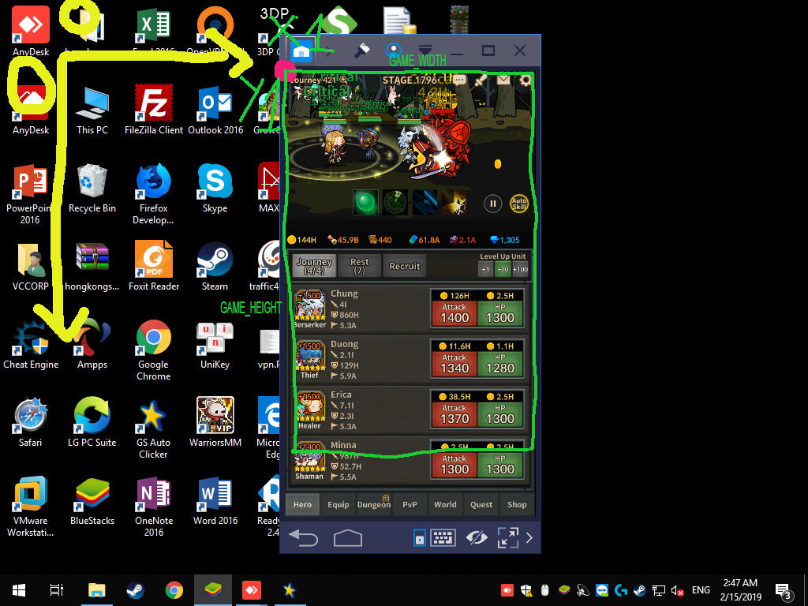

# Infinity heroes bot bypass captcha

## Introduction

This bot only help you by pass the "drag gem into beg" captcha. It doesn't include auto click function.
If you want auto click this game, you should find your way lmao.

## Installation

- Install python 3 ([Download](https://www.python.org/downloads/))
- Open `cmd` on windows and run: `pip install -r requirements.txt` or `pip3 install -r requirements.txt`

Now you must manual calculate the coordinate for the script to know where is the game:
- See the picture 
- You have to find 4 variables: X1, Y1, GAME_WIDTH, GAME_HEIGHT (not the full height of the game, it doesn't include the instruction text of captcha)
- At top left corner of screen it's point (0,0). You can use photoshop or any software to calculate it in pixel
- Create a file and name it `.env`, copy content from `.env.example` and fill your found variables above
- Open `cmd` and cd to this directory, run `python bot.py` or `python3 bot.py`

** Bonus **

If you like auto click point in journey, you can use any auto click software to plus `attack` and `hp` in game, lmao. But remember set interval at least 7-10 seconds between clicks, and this bot will resolve your captcha as well.

## Check list

- [x] Make bot working
- [ ] Write installing documentation
- [x] Move config outside the code
- [ ] Learn python, lmao
